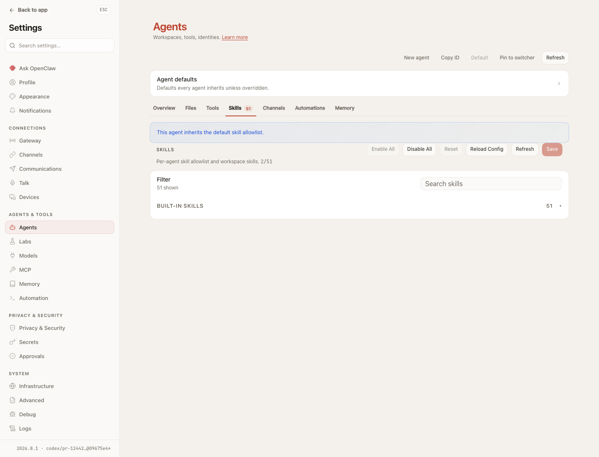

## Exact-head real Gateway/UI proof

Capture source head: `09675e40d30d9301f96764723ab4e5d3959ecc92`.

This redacted transcript records a headed Chromium session against the bundled
Control UI and an isolated live Gateway built from the source checkout:

```text
$ git rev-parse HEAD
09675e40d30d9301f96764723ab4e5d3959ecc92
$ curl -sS http://127.0.0.1:39210/health
{"ok":true,"status":"live"}

initial: inherited default skill allowlist; 54/54; Enable All disabled
click browser-automation: custom allowlist; 53/54; config.set acknowledged
click Reset: config.patch agents.list[].skills acknowledged
reload: inherited state restored; skills.status and hot-reload events recorded
gateway build: 2026.8.1-09675e4
```



The screenshot is the post-reset state from the real surface: the inherited
allowlist notice is visible, Reset is disabled because no authored override
remains, and the footer identifies the `09675e4` build. The local model layer
was not involved; Gateway, WebSocket, config mutation, and browser rendering
were real.
